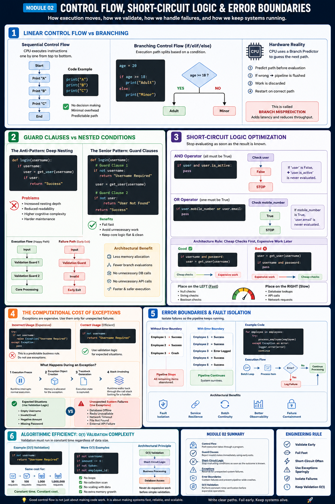

# Module 02: Control Flow, Short-Circuit Logic & Error Boundaries

## Overview

Control Flow governs how execution moves through a program. It determines the exact path the runtime follows while processing instructions, evaluating conditions, handling failures, and executing business logic.

This module introduces:

* Sequential vs Branching Execution
* Guard Clauses
* Short-Circuit Logic
* Exception Cost Analysis
* Error Boundaries
* O(1) Validation Architecture

---

# 1. Linear Control Flow vs Branching

## Sequential Control Flow

By default, the CPU executes instructions sequentially from top to bottom.

```text
[Start]
   ↓
[Print "A"]
   ↓
[Print "B"]
   ↓
[Print "C"]
   ↓
[End]
```

Example:

```python
print("A")
print("B")
print("C")
```

This execution path requires no decision-making and introduces minimal overhead.

---

## Branching Control Flow (if / elif / else)

Branching splits the execution path based on a condition.

```python
age = 20

if age >= 18:
    print("Adult")
else:
    print("Minor")
```

Execution Flow:

```text
           age >= 18 ?
                │
       YES ─────┼───── NO
        │              │
     Adult         Minor
```

### Hardware Reality

When a CPU encounters a conditional branch, modern processors use a mechanism called a **Branch Predictor**.

The processor attempts to predict which path execution will take before the condition is fully evaluated.

If the prediction is incorrect:

1. The execution pipeline is flushed.
2. Speculative work is discarded.
3. Execution restarts on the correct path.

This is called:

**Branch Misprediction**

Branch mispredictions introduce additional latency and reduce throughput.

---

# 2. Guard Clauses vs Nested Conditions

## The Anti-Pattern: Deep Nesting

```python
def login(username):

    if username:

        user = get_user(username)

        if user:

            return "Success"
```

Problems:

* Increased nesting depth
* Reduced readability
* Higher cognitive complexity
* Harder maintenance

---

## The Senior Pattern: Guard Clauses

Guard Clauses reject invalid states immediately.

```python
def login(username):

    # Guard Clause 1
    if not username:
        return "Username Required"

    user = get_user(username)

    # Guard Clause 2
    if not user:
        return "User Not Found"

    return "Success"
```

Execution Flow:

```text
[Input]
    ↓
[Validation Guard 1]
    ↓
[Validation Guard 2]
    ↓
[Core Processing]
```

Failure Path:

```text
[Input]
    ↓
[Validation Guard]
    ↓
[Invalid]
    ↓
[Early Exit]
```

### Architectural Benefit

Failing fast prevents:

* Unnecessary memory allocations
* Additional branch evaluations
* Database calls
* API requests
* Business pipeline execution

---

# 3. Short-Circuit Logic Optimization

Short-circuit evaluation stops processing as soon as the final result becomes known.

---

## AND Operator

For an `and` expression to be True, every condition must be True.

If a condition evaluates to False, execution stops immediately.

```python
if user and user.is_active:
    pass
```

Execution Flow:

```text
Check user
    ↓
False
    ↓
STOP
```

`user.is_active` is never evaluated.

---

## OR Operator

For an `or` expression to be True, only one condition must be True.

```python
if user.mobile_number or user.email:
    pass
```

Execution Flow:

```text
Check mobile_number
      ↓
True
      ↓
STOP
```

`user.email` is never evaluated.

---

## Architecture Rule

### Cheap Checks First, Expensive Work Later

Good:

```python
if username and password:
    user = get_user(username)
```

Bad:

```python
user = get_user(username)

if username and password:
    pass
```

Place:

* Null checks
* String checks
* Boolean checks

on the left side.

Place:

* Database lookups
* API calls
* Network requests

on the right side.

This minimizes wasted execution.

---

# 4. The Computational Cost of Exceptions

Using exceptions for ordinary validation logic is an expensive architectural anti-pattern.

---

## Incorrect Usage

```python
try:
    if not username:
        raise Exception("Username Required")
except Exception:
    pass
```

The username being empty is a predictable business rule.

It should be handled using validation logic.

---

## Correct Usage

```python
if not username:
    return "Username Required"
```

---

## What Happens During an Exception?

When an exception occurs:

### 1. Execution Freeze

The runtime interrupts normal execution.

### 2. Exception Object Creation

The runtime allocates memory for the exception.

### 3. Traceback Generation

Execution state is captured.

### 4. Stack Unwinding

The runtime walks backward through the call stack searching for a matching exception handler.

This process consumes thousands of additional CPU instructions.

---

## Validation vs Exceptions

### Expected Situations

Use Validation Logic

```text
• Empty Username
• Invalid Email
• Negative Amount
• Missing Password
```

### Unexpected System Failures

Use Exceptions

```text
• Database Offline
• Redis Unavailable
• Network Timeout
• File Not Found
• External API Failure
```

---

# 5. Error Boundaries & Fault Isolation

An Error Boundary is a protective layer that isolates failures without crashing the entire processing pipeline.

---

## Without Error Boundary

```text
Employee 1 -> Success
Employee 2 -> Success
Employee 3 -> Crash

Pipeline Stops
```

Every remaining item is abandoned.

---

## With Error Boundary

```text
Employee 1 -> Success
Employee 2 -> Success
Employee 3 -> Error Logged
Employee 4 -> Success
Employee 5 -> Success
```

The pipeline survives.

---

## Example

```python
for employee in employees:

    try:
        process_employee(employee)

    except Exception as error:
        logger.error(error)
        continue
```

Execution Flow:

```text
Batch Loop
    ↓
Process Item
    ↓
Error?
    ↓
YES
    ↓
Log Failure
    ↓
Continue Processing
```

---

## Architectural Benefit

Error Boundaries provide:

* Fault Isolation
* Service Resilience
* Batch Continuity
* Better Observability
* Failure Containment

---

# 6. Algorithmic Efficiency: O(1) Validation Complexity

Enterprise systems should perform validation using constant-time operations whenever possible.

Example:

```python
if not username:
    return "Username Required"
```

This operation requires the same amount of work regardless of system size.

Whether:

```text
10 requests
100 requests
1,000 requests
1,000,000 requests
```

The validation cost remains effectively constant.

---

## O(1) Validation Examples

```python
if not username:
```

```python
if amount <= 0:
```

```python
if not token:
```

```python
if not employee_id:
```

These checks:

* Do not iterate collections
* Do not scale with data volume
* Do not increase memory usage

---

## Architectural Principle

Always execute:

```text
O(1) Validation
        ↓
Short-Circuit Logic
        ↓
Business Processing
        ↓
Database Access
```

Never perform expensive work before simple validation.

---

# Module 02 Summary

## Control Flow

The path execution takes through a program.

---

## Guard Clauses

Reject invalid states immediately using early exits.

---

## Short-Circuit Logic

Stop evaluating conditions as soon as the outcome is known.

---

## Exceptions

Reserve for unexpected system failures.

---

## Error Boundaries

Contain failures and prevent pipeline-wide crashes.

---

## O(1) Validation

Perform constant-time verification before expensive operations.

---

# Engineering Rule

```text
Validate Early
Fail Fast
Short-Circuit Often
Use Exceptions Sparingly
Isolate Failures
Keep Validation O(1)
```

